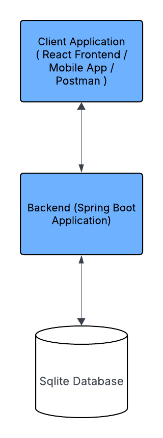

# 🧭 Maplewood Course Planning App


A full-stack course enrollment and planning platform structured as a monorepo, consisting of a Spring Boot backend and a React frontend.

The system is designed to reflect real-world academic scheduling constraints and resource management rules.

---

## ⚡ Quick Links

[🚀 Getting Started](#getting-started) •
[🏗️ Architecture](#architecture) •
[🧠 Design Strategy](#scheduling-and-resource-allocation-strategy) •
[🧪 Testing Scenarios](#testing) •
[⚖️ Trade-offs And Assumptions](#trade-offs-and-assumptions)

---

##  Table of Contents

- [ Project Structure](#project-structure)
- [ Tech Stack](#tech-stack)
- [ Architecture](#architecture)
- [ Scheduling & Resource Allocation Strategy](#scheduling-and-resource-allocation-strategy)
- [ Core Design Philosophy](#core-design-philosophy)
- [ Trade-offs And Assumptions](#trade-offs-and-assumptions)
- [ Future Enhancements](#future-enhancements)
- [ Getting Started](#getting-started)
- [ Useful Commands](#useful-commands)
- [ UI User Flow](#ui-user-flow)
- [ Testing](#testing)
- [ Troubleshooting](#troubleshooting)
- [ Submission Notes](#submission-notes)


## Project Structure

```text
.
├── course-planning-api              # Spring Boot backend
│   ├── Dockerfile
│   ├── mvnw
│   ├── pom.xml
│   └── src
│       ├── main
│       └── test

├── course-planning-ui               # React + Vite frontend
│   ├── app
│   │   ├── api
│   │   ├── components
│   │   ├── store
│   │   ├── types
│   │   └── utilities
│   ├── index.html
│   ├── package.json
│   ├── vite.config.ts
│   └── tsconfig.json
│
├── docker-compose.yml              # Multi-container setup
├── maplewood_school.sqlite         # SQLite database
└── README.md
```

---

## Tech Stack

| Layer | Technology |
|------|------------|
| Frontend | React, Vite, TypeScript |
| Backend | Spring Boot, Spring Web, Spring Data JPA |
| Database | SQLite |
| Build Tools | Maven, npm |
| DevOps | Docker, Docker Compose |

---

## Architecture



---

## Scheduling And Resource Allocation Strategy

The core challenge is not only student enrollment validation but also efficient pre-allocation of academic resources.

These resources include:

- teacher availability
- classroom availability
- teacher subject expertise
- course workload hours
- timetable collisions
- student demand across courses

---

## Core Design Philosophy

Instead of solving conflicts only at registration time, the system uses a **two-phase planning model**:

```text
Phase 1: Administrative Schedule Planning
Phase 2: Student Enrollment Validation
```

This mirrors how real schools operate.

---

## Phase 1: Preconfigured Academic Scheduling

Before students register, administrators define available course sections for the term.

Each section is created using four core constraints:

### 1. Teacher Availability

Teachers can only be assigned to times they are available.

Example:

```text
Mr. Smith available:
Mon–Fri, 08:00–13:00
```

Unavailable slots are excluded during scheduling.

---

### 2. Teacher Skill Set / Subject Qualification

Teachers are matched only to courses they are qualified to teach.

Example:

```text
Ms. Johnson:
✔ Chemistry
✔ Biology
✘ Mathematics
```

This prevents invalid resource assignment.

---

### 3. Room Availability

A classroom cannot host multiple sections at the same time.

Example:

```text
Room A101
Mon 10:00–11:00 already occupied
```

That slot becomes unavailable for other sections.

---

### 4. Course Workload Hours (Scheduling Driver)

Each course has a required number of teaching hours per week, and this was a major guide when planning timeslots.

Examples:

```text
Algebra I = 5 hours/week
Chemistry I = 3 hours/week
Programming Basics = 4 hours/week
```

The scheduling engine uses workload hours to determine:

- number of sessions required
- duration of each session
- weekly timetable placement
- efficient use of teacher time
- efficient use of classrooms

Example:

```text
Course requires 5 hours/week

Possible allocation:
Mon 09:00–10:00
Tue 09:00–10:00
Wed 09:00–10:00
Thu 09:00–10:00
Fri 09:00–10:00
```

This ensures the timetable reflects real academic workload requirements.

---

## Output of Phase 1

The result is a set of ready-to-enroll course sections such as:

```text
Algebra I - Section A
Teacher: Mr. Brown
Room: B201
Mon/Wed/Fri 09:00–10:00

Chemistry I - Section B
Teacher: Ms. Johnson
Room: Lab 1
Tue/Thu 11:00–12:30
```

Students register into these prebuilt sections rather than raw courses.

---

## Phase 2: Student Enrollment Validation

Once sections exist, student registration becomes simpler and faster.

The system validates:

- prerequisite completion
- duplicate enrollment
- student schedule conflicts
- maximum course load
- seat availability

Because operational constraints were already solved earlier, student enrollment becomes efficient and predictable.

---

## Why This Approach Is Effective

### Separation of Concerns

Administrative planning and student enrollment solve different problems.

By separating them:

- scheduling remains manageable
- enrollment becomes faster
- fewer runtime conflicts occur

---

### Better Resource Utilization

The school can maximize use of:

- teachers
- classrooms
- available timetable slots
- weekly teaching capacity

---

### Scalable Model

This design can grow into advanced optimization later:

- auto timetable generation
- waitlists
- teacher workload balancing
- peak demand forecasting
- room capacity optimization

---
## Trade-offs And Assumptions

- SQLite was selected for its simplicity and lack of external configuration requirements.
- The scheduling engine assumes that sections are created and managed by administrators before the enrollment period begins.
- Enrollment validation prioritizes correctness and data consistency over advanced optimization strategies.
- Due to time constraints, the focus was placed on core business workflows rather than UI refinement or visual polish.
- The system is designed for single-instance deployment and does not yet support horizontal scaling.
---

## Future Enhancements

Given more time, the planning engine could evolve into:

- timetable optimization algorithm
- constraint satisfaction solver
- teacher workload balancing
- preferred timeslot matching
- AI-assisted schedule generation
- demand or event driven section creation 
---
## Getting Started

### Prerequisites

Install:

- Docker
- Docker Compose

Verify:

```bash
docker --version
docker compose version
```

---

### Run Locally

#### 1. Clone Repository

```bash
git clone https://github.com/mgwman006/green_iguana.git
cd green_iguana
```

---

#### 2. Ensure Database Exists

```bash
ls maplewood_school.sqlite
```

---

#### 3. Start Application

```bash
docker compose up --build
```

---

#### 4. Open Application

| Service | URL |
|--------|-----|
| Frontend | http://localhost:3000 |
| Backend | http://localhost:8080 |

---

#### Stop Application

```bash
docker compose down
```

---

## Useful Commands

### Running Containers

```bash
docker ps
```

### View Logs

```bash
docker compose logs -f
```

### Backend Logs

```bash
docker logs maplewood-backend
```

### Frontend Logs

```bash
docker logs maplewood-frontend
```

### Rebuild

```bash
docker compose up --build
```
---
## UI User Flow
### Login Page
When the application starts, the first screen displayed is a simulated authentication page.
Users are asked to enter a **Student ID**.
For demo purposes, it is recommended to use:101
This student account contains enough existing data to explore the system features.
Once a valid Student ID is entered, click Next to proceed to the Dashboard.


### Course Registration Flow
The following screenshots demonstrate how a student can register for a course.

#### 1. Dashboard
From the Dashboard, click the menu button in the top-right corner.
This will open the navigation menu.


#### 2. Click Browse Course
From the menu options, click Browse Courses. You will be redirected to a page listing all available courses.


#### 3. Select a Course
Click View on any course of interest to see full course details and available enrollment options.


#### 4. Enroll in an Available Section
The course details page displays:

- Course information
- Available sections
- Time slots
- Enrollment actions

Click Enroll on a preferred section.


#### 5. Enrollment Result
After submitting enrollment, the system returns either:
##### ✅ Success Response

##### ❌ Failure Response
Enrollment blocked due to business rule validation such as:

- schedule conflict
- missing prerequisite
- full capacity
- maximum course load reached


### Enrollments Page
#### 1. Dashboard
From the Dashboard, click the menu button in the top-right corner.
This will open the navigation menu.


#### 2. Click Browse Course
From the menu options, click **Enrollments**.
You will be redirected to the page showing all courses currently registered for the active semester.


#### 3. Current Semester Enrolments
he Enrollments page displays the student’s active course registrations for the current semester.
Users can review their selected courses and current schedule.

___

## Testing

### Unit Tests Coverage


### Business Testing Scenarios

#### ✅ Scenario 1: Valid Enrollment

Student **Joseph Young** (`student_id: 101`) enrolls in **Chemistry I**

Checks:

- prerequisite satisfied
- no schedule conflict
- below 5-course limit

Result:

```text
Enrollment successful
```

---

#### ❌ Scenario 2: Missing Prerequisite

Student attempts **English II: Literature**

Required:

```text
English I: Composition
```

Result:

```text
Enrollment blocked - missing prerequisite
```

---

#### ❌ Scenario 3: Schedule Conflict

Student already enrolled in:

```text
Chemistry I (13:00–14:00)
```

Attempts:

```text
Algebra I (13:00–14:00)
```

Result:

```text
Enrollment blocked - schedule conflict
```

---

#### ❌ Scenario 4: Maximum Course Limit (5)

Ensure the student is already enrolled in the following five courses:

- World History
- Chemistry I
- Algebra I (Different Time Slot with Chemistry 1)
- Intro to Programming
- Journalism

The student then attempts to enroll in **Biology I** as a sixth course.

Since maximum course load validation is executed first, enrollment is rejected.

Result:

```text
Enrollment blocked - maximum course limit reached
```

---

#### Valid Courses that Joseph Young can enroll at the same time (Student Number 101)

- World History
- Chemistry I
- Algebra I
- Intro to Programming
- Journalism

---

## Troubleshooting

### Backend Not Starting

```bash
docker logs maplewood-backend
```

### Frontend Not Loading

```bash
docker logs maplewood-frontend
```

---

## Quick Start

```bash
docker compose up --build
```


## Submission Notes

This solution focuses on demonstrating:

- practical system design
- business rule enforcement
- clean separation of responsibilities
- maintainable full-stack architecture
- realistic academic scheduling workflows